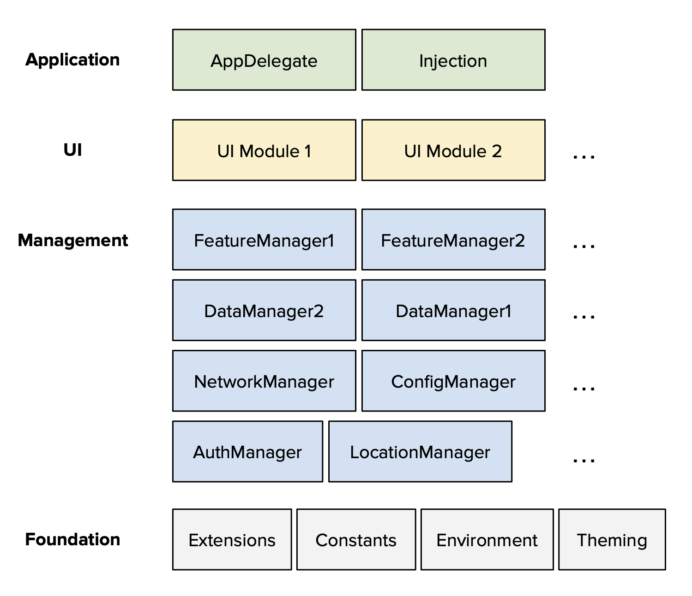

# Thoughts on App Architecture

This document contains my thoughts on iOS/Apple App Architecture. These are fairly opinionated, and derived from working on these platforms since 2008.

> **Note:** These practices are intended for enterprise-level development where maintainability, scalability, performance, and collaboration are all primary concerns. Small personal projects may benefit from simpler approaches and can selectively adopt these patterns as needed.

## Overhead Map



There are four distinct layers, each with clearly defined responsibilities. Modules form an acyclic graph where modules can depend on others in the same layer, or below.

#### 1. Application Layer
- **Responsibilities**: 
  - AppDelegate implementation
  - Main UI/Navigation setup and orchestration
  - Initial dependency injection configuration
- **Characteristics**: 
  - Minimal business logic
  - Heavy focus on lifecycle management
  - Entry point for the application

#### 2. UI Layer
- **Responsibilities**: 
  - All user interface components (Views, ViewControllers)
  - View models and presentation logic
  - User interaction handling
- **Characteristics**: 
  - Stateful components with clear boundaries
  - Managers/data sources are cleanly injected
  - Testable presentation logic

#### 3. Management Layer
- **Responsibilities**: 
  - Singletons for app state management
  - Business logic implementation (below UI level)
  - Data persistence and synchronization
- **Characteristics**: 
  - DI lifecycle bound to current user session
  - Single source of truth pattern:
    - Each module is responsible for maintaining and exposing state for its feature.

#### 4. Foundation Layer
- **Responsibilities**: 
  - Extensions and utility functions
  - Constants and configuration values
  - Cross-cutting concerns (logging, networking helpers)
- **Characteristics**: 
  - Stateless and immutable
  - Reusable across all layers
  - No external dependencies

### Developer-Friendly Modularity

Modularizing the code properly is critically important. It cannot be considered a _chore_ to creating new modules, or refactor large modules into components.

That is one of the purposes of the Velocity framework. There is no overhead to creating modules other than creating a new directory and placing in a simple package.yml file to signify the presence of a module package.

Module packages follow a very simple pattern in the filesystem:

```
MyNewCode/
  package.yml
  MyNewCode/        
  MyNewCodeImpl/
  MyNewCodeTests/
  MyNewCodeMocks/
```

Each package always contains a subdirectory for tests, and one for mocks that can be used by higher level tests.

All packages contain a 'main' module named after the package. For UI and Foundation layers, these modules contain the main code for the module. For Manager layers, the main module is the "API" module that contains data models and protocols. The Impl module contains the implementation that is injected using the Inject framework.

### Lightweight Dependency Injection

I want to qualify the discussion of DI systems to refer to framework-based, automated DI -- i.e. tools that simplify, or create a DSL to make DI more concise (e.g. the Inject framework.)

The complexity of an automated Dependency injection system is a controversial topic. Here are my opinionated rules for automated DI frameworks:

1. There should only ever be *one scope* for automated DI objects: **the user**.
   - Apps without the concept of independent users will have one permanent scope.
   - Apps that allow user login/logout will have one scope that is torn down/build up for each user (i.e. only one scope is active at a time.)
2. There should be no concept of sub-scopes, feature-level scopes, etc.
   - Some frameworks attempt to use DI for telescopingly-smaller scopes. I have only seen this become a usability nightmare, and has never been worth the cost. 
   - Any resources that are used by a transient user flow should be manually instantiated and injected where needed. An explicit coordinator pattern with manual injection is better an implicit per-feature injection.
3. There must only be one implementation for a DI protocol.
   - Automated DI is meant to improve incremental builds, and help testing. It should not be a place for situational/configurable injection of different implementations for the same protocol.
   - Allowing configurable implementation injection makes it more difficult to trace what is happening at runtime, and where to find actual implementation code during debugging.
   - Any configurable behavior should be a detail inside single implementation. E.g. rather than separate implementations of a Fetcher vs. CachingFetcher, the caching aspect should be a configurable option of a single Fetcher implementation.

### SwiftUI is not Robustly Performant

### Reactive Everywhere

### Immutable Everywhere

